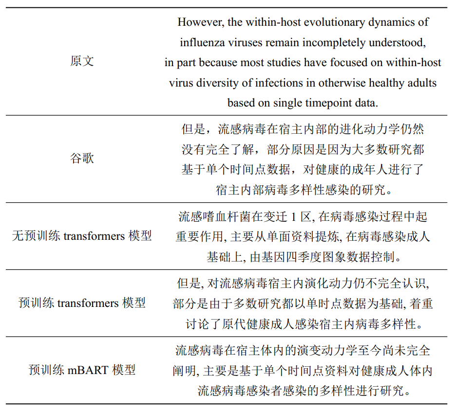

# biomedical-translation

中国科学技术大学-微软亚洲研究院创新实践项目 医学文献翻译组

## 数据

自己收集所得的数据，[Google云盘地址](https://drive.google.com/drive/folders/13kN6eF7K40JBJtn_nn6EdBcSVivBA0y0?usp=sharing)

## 模型

#### 1. 基于`pytorch`实现的标准transformer模型（无预训练模型）

**训练方法：**

首先基于数据集训练分词器：

```apache
cd typical_transformer
python mytokenize.py
```

分词器训练完毕后，再训练整个模型：

```apache
python main.py
```

可根据需求修改`config.py`中的模型参数。

#### 2. 基于`transformers`库实现的transformer模型（有预训练模型）

**训练方法：**

```apache
cd pretrained_transformers
python train.py
```

**使用该模型翻译文献：**

```apache
python main.py --pdf --field abstract --filename FILENAME_WITH_PATH
```

#### 3. 基于`transformers`库实现的mBART模型（有预训练模型）

**训练方法：**

```apache
cd pretrained_transformers
python train_mbart.py
```

**使用该模型翻译文献：**

```apache
python main_mbart.py --pdf --field abstract --filename FILENAME_WITH_PATH
```

## 结果


|      | 无预训练transformer | 预训练transformer | 预训练mBART |
| ------ | --------------------- | ------------------- | ------------- |
| BLEU | 20.93               | 25.33             | 28.96       |


翻译单句示例：


## 代码文件目录结构说明

#### get_data

主要用于获取数据。

* `cut_sentences.py` 实现中英文分句
* `get_abs_data.py` 爬取[https://www.chinapubmed.net](https://www.chinapubmed.net)上的中英文摘要数据
* `get_art_pdf.py` 爬取[All Articles | bioRxiv](https://www.biorxiv.org/content/early/recent)上的论文
* `get_pdf_content.py` 抽取pdf论文中的标题、摘要和简介

#### plain_transformer

基于`pytorch`实现transformer的基本架构。

* `beam_decoder.py` 实现束搜索解码
* `config.py` 模型参数配置
* `data_loader.py` 装载数据
* `model.py` 模型基本架构的实现
* `main.py` 主函数
* `mytokenize.py` 训练分词器
* `train.py` 训练模型
* `utils.py` 某些功能函数的实现

#### pretrained_transformers

基于`transformers`库及其所提供的预训练模型进行训练。

* `main_mbart.py` 使用mBART模型的主函数
* `main.py` 使用transformer模型的主函数
* `metric.py` 用于计算模型BLEU分数
* `train_mbart.py` 训练mBART模型
* `train.py` 训练transformer模型
